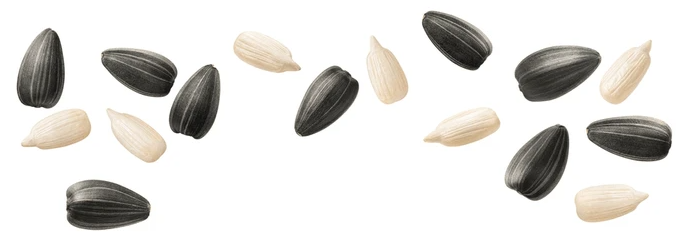

# 🔍 Contagem Avançada de Objetos com OpenCV - Projeto Melhorado

[](https://www.python.org/downloads/)
[](https://opencv.org/)
[](https://opensource.org/licenses/MIT)

## 📋 Sobre o Projeto

Este repositório contém a versão melhorada do projeto de **Contagem de Objetos em Imagens** utilizando **Visão Computacional** com a biblioteca **OpenCV**.

O sistema foi projetado para detectar e contar objetos de diferentes tamanhos, cores e contrastes em diversas imagens.

## 🎯 Melhorias Implementadas

Em relação à versão inicial, as seguintes melhorias foram feitas:

✅ Separação do código em módulos (`main.py`, `count_objects.py`)  
✅ Geração automática de máscaras intermediárias para debug  
✅ Adição de técnicas de **Watershed** e **Transformada de Distância** para separar objetos próximos  
✅ Ajuste de parâmetros para melhorar a precisão da contagem  
✅ Inclusão de imagens de diferentes cenários (chocolates, sementes, moedas, gemas)  
✅ Criação de um resumo de contagem final por imagem  
✅ Estruturação de pastas com separação de entrada e saída (`images/`, `processed_output/`)  
✅ README detalhado com instruções, exemplos e imagens

## 🖼️ Exemplos de Resultados

| Imagem Original | Resultado com Contagem |
|-----------------|------------------------|
|  |  |
|  |  |

## 🚀 Tecnologias Utilizadas

- **Python 3.7+**
- **OpenCV (cv2)**
- **NumPy**

### Técnicas aplicadas:

- Threshold adaptativo
- Detecção de bordas (Canny)
- Operações morfológicas
- Transformada de distância
- Watershed
- Filtros por área mínima

## 📦 Instalação

### Pré-requisitos:
- Python 3.7 ou superior
- pip

### Instalação das Dependências:
```bash
pip install -r requirements.txt
```

## 🔧 Como Executar

### Estrutura de Pastas:

```
contagem_objetos/
├── images/               # Imagens de entrada
├── processed_output/     # Imagens de saída com resultados
├── main.py               # Script principal
├── count_objects.py      # Módulo de contagem
├── requirements.txt      # Dependências do projeto
└── README.md             # Este arquivo
```

### Executar:
```bash
python count_objects.py
```

## 📝 Licença
